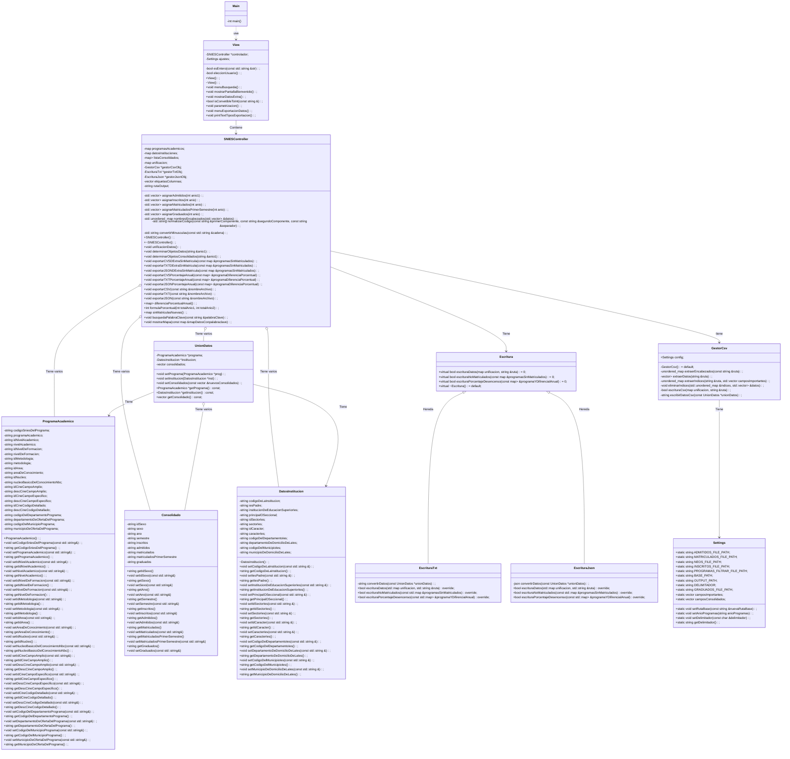

```mermaid
classDiagram

    class Consolidado{
        -string idSexo
        -string sexo
        -string  ano
        -string  semestre
        -string  inscritos
        -string  admitidos
        -string  matriculados
        -string  matriculadosPrimerSemestre
        -string  graduados
        +string  getIdSexo()
        +void setIdSexo(const std::string&)

        +string getSexo()
        +void setSexo(const std::string&)

        +string  getAno()
        +void setAno(const std::string&)

        +string  getSemestre()
        +void setSemestre(const std::string&)

        +string  getInscritos()
        +void setInscritos(const std::string&)

        +string  getAdmitidos()
        +void setAdmitidos(const std::string&)

        +string  getMatriculados()
        +void setMatriculados(const std::string&)

        +string  getMatriculadosPrimerSemestre()
        +void setMatriculadosPrimerSemestre(const std::string&)

        +string  getGraduados()
        +void setGraduados(const std::string&)
    }


    class DatosInstitucion{
        -string codigoDeLaInstitucion;
        -string iesPadre;
        -string institucionDeEducacionSuperiorIes;
        -string principalOSeccional;
        -string idSectorIes;
        -string sectorIes;
        -string idCaracter;
        -string caracterIes;
        -string codigoDelDepartamentoIes;
        -string departamentoDeDomicilioDeLaIes;
        -string codigoDelMunicipioIes;
        -string municipioDeDomicilioDeLaIes;

        ~DatosInstitucion();

        +void setCodigoDeLaInstitucion(const std::string &);
        +string getCodigoDeLaInstitucion();

        +void setIesPadre(const std::string &);
        +string getIesPadre();

        +void setInstitucionDeEducacionSuperiorIes(const std::string &);
        +string getInstitucionDeEducacionSuperiorIes();

        +void setPrincipalOSeccional(const std::string &);
        +string getPrincipalOSeccional();

        +void setIdSectorIes(const std::string &);
        +string getIdSectorIes();

        +void setSectorIes(const std::string &);
        +string getSectorIes();

        +void setIdCaracter(const std::string &);
        +string getIdCaracter();

        +void setCaracterIes(const std::string &);
        +string getCaracterIes();

        +void setCodigoDelDepartamentoIes(const std::string &);
        +string getCodigoDelDepartamentoIes();

        +void setDepartamentoDeDomicilioDeLaIes(const std::string &);
        +string getDepartamentoDeDomicilioDeLaIes();

        +void setCodigoDelMunicipioIes(const std::string &);
        +string getCodigoDelMunicipioIes();

        +void setMunicipioDeDomicilioDeLaIes(const std::string &);
        +string getMunicipioDeDomicilioDeLaIes();
    }

    class ProgramaAcademico{
        -string codigoSniesDelPrograma;
        -string programaAcademico;
        -string idNivelAcademico;
        -string nivelAcademico;
        -string idNivelDeFormacion;
        -string nivelDeFormacion;
        -string idMetodologia;
        -string metodologia;
        -string idArea;
        -string areaDeConocimiento;
        -string idNucleo;
        -string nucleoBasicoDelConocimientoNbc;
        -string idCineCampoAmplio;
        -string descCineCampoAmplio;
        -string idCineCampoEspecifico;
        -string descCineCampoEspecifico;
        -string idCineCodigoDetallado;
        -string descCineCodigoDetallado;
        -string codigoDelDepartamentoPrograma;
        -string departamentoDeOfertaDelPrograma;
        -string codigoDelMunicipioPrograma;
        -string municipioDeOfertaDelPrograma;
        +ProgramaAcademico();
        +void setCodigoSniesDelPrograma(const std::string&);
        +string getCodigoSniesDelPrograma();

        +void setProgramaAcademico(const std::string&);
        +string getProgramaAcademico();

        +void setIdNivelAcademico(const std::string&);
        +string getIdNivelAcademico();

        +void setNivelAcademico(const std::string&);
        +string getNivelAcademico();

        +void setIdNivelDeFormacion(const std::string&);
        +string getIdNivelDeFormacion();

        +void setNivelDeFormacion(const std::string&);
        +string getNivelDeFormacion();

        +void setIdMetodologia(const std::string&);
        +string getIdMetodologia();
        +void setMetodologia(const std::string&);
        +string getMetodologia();

        +void setIdArea(const std::string&);
        +string getIdArea();
        +void setAreaDeConocimiento(const std::string&);
        +string getAreaDeConocimiento();
        +void setIdNucleo(const std::string&);
        +string getIdNucleo();
        +void setNucleoBasicoDelConocimientoNbc(const std::string&);
        +string getNucleoBasicoDelConocimientoNbc();
        +void setIdCineCampoAmplio(const std::string&);
        +string getIdCineCampoAmplio();
        +void setDescCineCampoAmplio(const std::string&);
        +string getDescCineCampoAmplio();
        +void setIdCineCampoEspecifico(const std::string&);
        +string getIdCineCampoEspecifico();
        +void setDescCineCampoEspecifico(const std::string&);
        +string getDescCineCampoEspecifico();
        +void setIdCineCodigoDetallado(const std::string&);
        +string getIdCineCodigoDetallado();
        +void setDescCineCodigoDetallado(const std::string&);
        +string getDescCineCodigoDetallado();
        +void setCodigoDelDepartamentoPrograma(const std::string&);
        +string getCodigoDelDepartamentoPrograma();
        +void setDepartamentoDeOfertaDelPrograma(const std::string&);
        +string getDepartamentoDeOfertaDelPrograma();
        +void setCodigoDelMunicipioPrograma(const std::string&);
        +string getCodigoDelMunicipioPrograma();
        +void setMunicipioDeOfertaDelPrograma(const std::string&);
        +string getMunicipioDeOfertaDelPrograma();
    }

    class UnionDatos{
        -ProgramaAcademico *programa;
        -DatosInstitucion *institucion;
        -vector<Consolidado *> consolidados;
        +void setPrograma(ProgramaAcademico *prog);
        +void setInstitucion(DatosInstitucion *inst);

        +void setConsolidados(const vector<Consolidado *> &nuevosConsolidados);

        +ProgramaAcademico *getPrograma() const;
        +DatosInstitucion *getInstitucion() const;
        +vector<Consolidado *> getConsolidado() const;
    }
    class SNIESController{
        -map<string, ProgramaAcademico *> programasAcademicos;
        -map<string, DatosInstitucion *> datosInstituciones;
        -map<string, map<string, Consolidado *>> listaConsolidados;
        -map<std::string, UnionDatos *> unificacion;
        -GestorCsv *gestorCsvObj;
        -EscrituraTxt *gestorTxtObj;
        -EscrituraJson *gestorJsonObj;
        -vector<string> etiquetasColumnas;
        -string rutaOutput;
        -std::vector<std::vector<std::string>> asignarAdmitidos(int anio1);
        -std::vector<std::vector<std::string>> asignarInscritos(int anio);
        -std::vector<std::vector<std::string>> asignarMatriculados(int anio);
        -std::vector<std::vector<std::string>> asignarMatriculadosPrimerSemestre(int anio);
        -std::vector<std::vector<std::string>> asignarGraduados(int anio);
        -std::unordered_map<std::string, int> nombresEncabezados(std::vector<std::vector<std::string>> &datos);
        -std::string normalizarCodigo(const string &primerComponente, const string &segundoComponente, const string &separador);
        -std::string convertirMinusculas(const std::string &cadena);

        +SNIESController();
        +~SNIESController();
        +void unificacionDatos();
        +void determinarObjetosDatos(string &anio1);
        +void determinarObjetosConsolidados(string &anio1);
        +void exportarCVSDExtraSinMatricula(const map<std::string, std::string> &programasSinMatriculados);
        +void exportarTXTDExtraSinMatricula(const map<std::string, std::string> &programasSinMatriculados);
        +void exportarJSONDExtraSinMatricula(const map<std::string, std::string> &programasSinMatriculados);
        +void exportarCVSPorcentajeAnual(const map<std::string, pair<int, int>> &programaDiferenciaPorcentual);
        +void exportarTXTPorcentajeAnual(const map<std::string, pair<int, int>> &programaDiferenciaPorcentual);
        +void exportarJSONPorcentajeAnual(const map<std::string, pair<int, int>> &programaDiferenciaPorcentual);
        +void exportarCSV(const string &nombreArchivo);
        +void exportarTXT(const string &nombreArchivo);
        +void exportarJSON(const string &nombreArchivo);
        +map<std::string, pair<int, int>> diferenciaPorcentualAnual();
        +int formulaPorcentual(int totalAnio1, int totalAnio2);
        +map<std::string, std::string> sinMatriculasNuevas();
        +void busquedaPalabraClave(const string &palabraClave);
        +void mostrarMapa(const map<std::string, UnionDatos *> &mapDatosConpalabraclave);
    }

    class GestorCsv{
        +Settings config;
        -GestorCsv() = default;
        -unordered_map<string, int> extraerEncabezados(const string &ruta);
        -vector<vector<string>> extraerDatos(string &ruta);
        -unordered_map<string, int> extraerIndices(string &ruta, std::vector<std::string> camposImportantes);
        -void eliminarIndices(std::unordered_map<std::string, int> &indices, std::vector<std::vector<std::string>> &datos);
        -bool escrituraCsv(map<std::string, UnionDatos *> unificacion, string &ruta);
        -string escribirDatosCsv(const UnionDatos *unionDatos);
}

    class View{
    -SNIESController *controlador;
    -Settings ajustes;
    -bool esEntero(const std::string &str);
    -bool eleccionUsuario();
    +View();
    ~View();
    +void menuBusqueda();
    +void mostrarPantallaBienvenido();
    +void mostrarDatosExtra();
    +bool isConvetibleToInt(const string &);
    +void parametrizacion();
    +void menuExportacionDatos();
    +void printTextTiposExportacion();
    }

    class Settings{
        +static string ADMITIDOS_FILE_PATH;
        +static string MATRICULADOS_FILE_PATH;
        +static string NEOS_FILE_PATH;
        +static string INSCRITOS_FILE_PATH;
        +static string PROGRAMAS_FILTRAR_FILE_PATH;
        +static string BASE_PATH;
        +static string OUTPUT_PATH;
        +static string DELIMITADOR;
        +static string GRADUADOS_FILE_PATH;
        +static vector<string> camposImportantes;
        +static vector<string> camposConsolidados;
        +static void setRutaBase(const string &nuevaRutaBase);
        +static void setAnioProgramas(string anioProgramas);
        +static void setDelimitador(const char &delimitador);
        +static string getDelimitador();
}

    class Escritura{
        +virtual bool escrituraDatos(map<std::string, UnionDatos *> unificacion, string &ruta) = 0;
        +virtual bool escrituraNoMatriculados(const map<std::string, std::string> &programasSinMatriculados) = 0;
        +virtual bool escrituraPorcentajeDesencenso(const map<std::string, pair<int, int>> &programaYDifirencialAnual) = 0;
        +virtual ~Escritura() = default;
}
    class EscrituraJson{
        -json convertirDatos(const UnionDatos *unionDatos);
        +bool escrituraDatos(std::map<std::string, UnionDatos *> unificacion, std::string &ruta) override;
        +bool escrituraNoMatriculados(const std::map<std::string, std::string> &programasSinMatriculados) override;
        +bool escrituraPorcentajeDesencenso(const std::map<std::string, pair<int, int>> &programaYDifirencialAnual) override;
}
    class EscrituraTxt{
        -string convertirDatos(const UnionDatos *unionDatos);
        +bool escrituraDatos(std::map<std::string, UnionDatos *> unificacion, std::string &ruta) override;
        +bool escrituraNoMatriculados(const std::map<std::string, std::string> &programasSinMatriculados) override;
        +bool escrituraPorcentajeDesencenso(const std::map<std::string, pair<int, int>> &programaYDifirencialAnual) override;
    }
    class Main{
        -int main()
    }
    Main..>View:usa
    View-->SNIESController : Contiene
    SNIESController o-- ProgramaAcademico:Tiene varios
    SNIESController o-- Consolidado:Tiene varios
    SNIESController o-- DatosInstitucion:Tiene varios
    SNIESController o-- UnionDatos:Tiene varios
    SNIESController --> Escritura:Tiene
    SNIESController --> GestorCsv:tiene
    UnionDatos o-- Consolidado:Tiene varios
    UnionDatos --> ProgramaAcademico:Tiene
    UnionDatos --> DatosInstitucion:Tiene
    Escritura <|-- EscrituraTxt:Hereda
    Escritura <|-- EscrituraJson:Hereda
    GestorCsv --> Settings:Tiene
```
